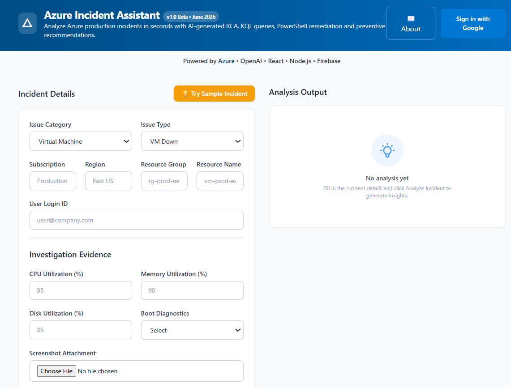
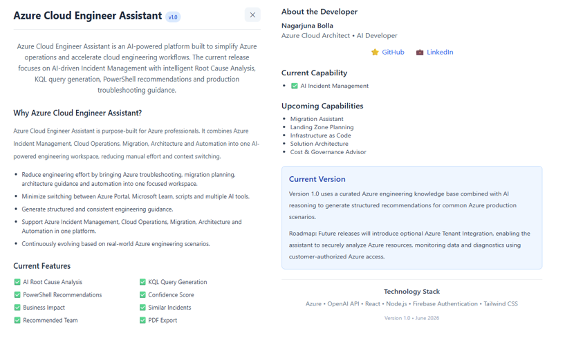
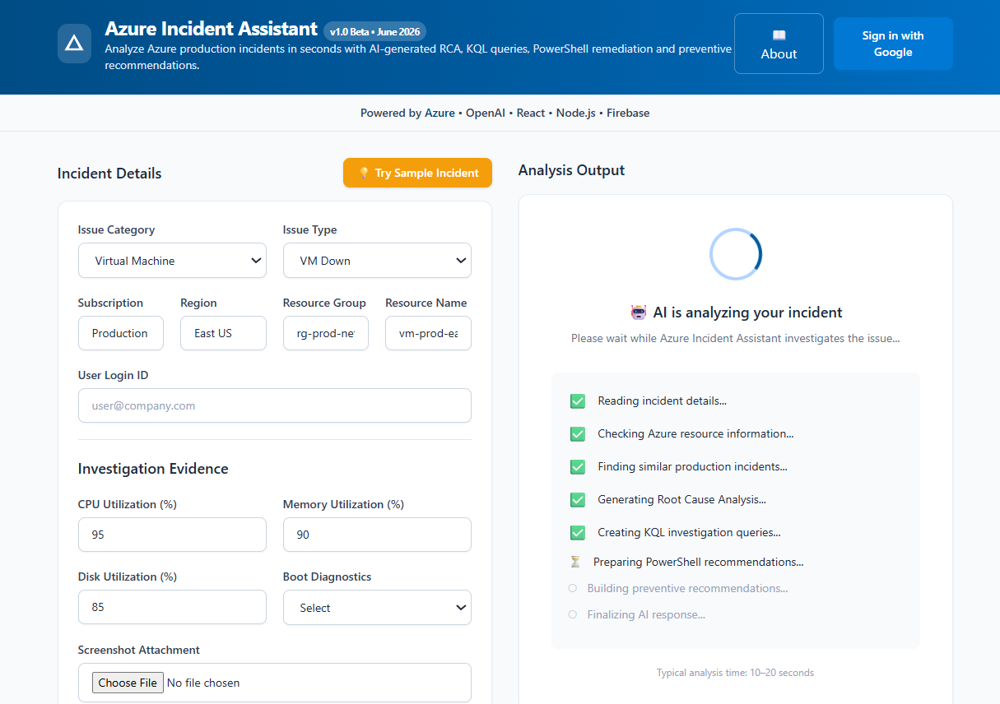

# Azure Cloud Engineer Assistant

An AI-powered platform designed to simplify Azure Cloud Operations by assisting engineers with Incident Management, Cloud Operations, Migration, Architecture, Automation and Infrastructure planning.

---

## 🚀 Live Demo

https://azure-incident-assistant.vercel.app

---

## ✨ Current Capability (v1.0)

### AI Incident Management

- ✅ AI Root Cause Analysis
- ✅ Confidence Score
- ✅ Severity Prediction
- ✅ Investigation Steps
- ✅ Business Impact Analysis
- ✅ Recommended Team
- ✅ Similar Incidents
- ✅ KQL Query Generation
- ✅ PowerShell Recommendations
- ✅ Permanent Fix
- ✅ Preventive Measures
- ✅ PDF Export
- ✅ Google Authentication

---

## 🚀 Upcoming Capabilities

### Azure Migration Assistant

- Azure Migrate Guidance
- Azure Site Recovery (ASR)
- Cross Subscription Migration
- Cross Tenant Migration
- Migration Validation
- Migration Checklist

### Landing Zone Planning

- CAF Landing Zone
- Hub & Spoke Design
- Management Groups
- Azure Policy
- RBAC Planning
- Network Architecture

### Infrastructure as Code

- Terraform
- Bicep
- ARM Templates
- Azure CLI
- PowerShell Automation

### Solution Architecture

- High Level Design (HLD)
- Low Level Design (LLD)
- Azure Best Practices
- Architecture Recommendations

### Cost & Governance Advisor

- Azure Cost Optimization
- Azure Advisor Recommendations
- Budget Planning
- Governance Best Practices

---

# 🖼️ Screenshots

## Home

---

## About

---

## Loading Screen

---

## 💻 Technology Stack

- Microsoft Azure
- OpenAI API
- React
- Node.js
- Firebase Authentication
- Tailwind CSS

---

## 🛣️ Roadmap

| Feature | Status |
|----------|--------|
| AI Incident Management | ✅ Completed |
| Migration Assistant | 🚧 Planned |
| Landing Zone Planning | 🚧 Planned |
| Infrastructure as Code | 🚧 Planned |
| Solution Architecture | 🚧 Planned |
| Cost & Governance Advisor | 🚧 Planned |

---

## 👨‍💻 Developer

**Nagarjuna Bolla**

Azure Cloud Architect | AI Solution Developer

10+ Years of Experience in Azure Cloud, Infrastructure, Migration, Automation and AI.

---

## 🔗 Connect with Me

**LinkedIn**

https://www.linkedin.com/in/nagarjuna-bolla-b14604104

**GitHub**

https://github.com/arjunairesume-design

---

## ⭐ Support

If you found this project useful, please consider giving it a ⭐ on GitHub.

Feedback, feature requests and contributions are always welcome.

---

Version **1.0** • June 2026
